# ⚡ Awesome Managed Streaming Data (Kafka)

  

  
  
  
  

> **A curated collection of top SaaS managed Kafka platforms, real-time event streaming architectures, distributed stream processing engines, CDC connectors, and open-source data pipeline solutions.**

---

## 💡 Overview

Welcome to the ultimate directory for **Managed Kafka**, **Event Streaming Platforms**, and **Real-Time Data Pipelines**. Whether you are building cloud-native microservices, scaling real-time analytics, or migrating from self-managed Kafka clusters to fully managed cloud infrastructure, this guide covers enterprise commercial offerings and top-tier open-source GitHub projects.

---

## 📌 Table of Contents

- [☁️ Managed Cloud SaaS Platforms](#%EF%B8%8F-managed-cloud-saas-platforms)
- [🚀 Open-Source GitHub Projects](#-open-source-github-projects)
- [🤝 How to Contribute](#-how-to-contribute)
- [⚠️ Disclaimer](#%EF%B8%8F-disclaimer)
- [❤️ Support & Community](#%EF%B8%8F-support--community)
- [📊 Star History](#-star-history)

---

## ☁️ Managed Cloud SaaS Platforms

### 📈 Market Overview & Insights
> **Market Size & Structure**: The global event streaming and managed streaming data market is estimated at **$3.5B+ (2026)** and is projected to surpass **$10B by 2030**, driven by rapid adoption of real-time AI, microservice architectures, and CDC pipelines.  
> **Market Fragmentation**: The sector is **moderately concentrated** with hyperscalers (AWS, Azure) and primary category defining specialists (Confluent) leading enterprise market share, while high-performance C++ alternatives (Redpanda) and multi-cloud providers (Aiven) capture high-growth niches.

Below is a comparison of top managed Kafka and event streaming SaaS providers, ordered by company scale (valuation / market capitalization):

| 🏢 Platform | 💰 Starting Price | 🎁 Free Tier / Trial Limit | 📊 Company Scale (Valuation / Market Cap) | 📝 Overview & Key Use Case |
| :--- | :--- | :--- | :--- | :--- |
| **[Amazon MSK](https://aws.amazon.com/msk/)** | ~$0.204 / broker-hour (`m7g.large`) | ❌ No free tier (Pay-as-you-go from creation) | **~$2.2 Trillion** (AWS / Amazon) | **AWS-native managed Kafka**: Provision clusters without infrastructure hassle. Integrates seamlessly with Lambda, S3, & IAM. |
| **[Azure Event Hubs](https://azure.microsoft.com/en-us/products/event-hubs/)** | ~$0.015 / hour per TU (~$11.16/mo) | ⏱️ 30-day Azure Free Trial ($200 credits) | **~$3.0 Trillion** (Microsoft) | **Azure's big data streaming service**: Kafka-compatible API endpoint supporting millions of events per second with Event Hubs Capture. |
| **[IBM Event Streams](https://www.ibm.com/products/event-streams)** | ~$0.05 / partition-hour | 🆓 **Free Lite Plan** (1 partition, shared cluster) + $200 trial credits | **~$200 Billion** (IBM) | **Enterprise Kafka for IBM Cloud**: Hybrid-cloud messaging backbone with enterprise security and IBM Cloud integration. |
| **[Confluent Cloud](https://www.confluent.io/confluent-cloud/)** | ~$0 (Basic tier scales to $0 when idle) | 🎁 **$400 Free Credits** (valid for 30 days) | **~$7.5 Billion** (Public: NASDAQ: CFLT) | **The enterprise standard for Kafka**: Created by Kafka's original founders. Fully managed Kafka, Flink, connectors, & schema registry. |
| **[Aiven for Apache Kafka](https://aiven.io/kafka)** | ~$35 / month (Developer Tier) | 🆓 **Permanent Free Tier** (1 cluster, 5 topics, 250 KiB/s) | **~$3.0 Billion** (Series D Unicorn) | **Multi-cloud managed data platform**: Deploy managed Kafka on AWS, GCP, Azure, and DigitalOcean with Terraform automation. |
| **[Redpanda Cloud](https://redpanda.com/)** | Pay-as-you-go serverless (consumption-based) | 🎁 **$100 Free Credits** (30-day Serverless trial) | **~$500 Million** (Series C) | **C++ Kafka-compatible engine**: 10x lower latency, no JVM, no Zookeeper. Supports BYOC (Bring Your Own Cloud) setups. |
| **[Instaclustr Kafka](https://www.instaclustr.com/)** | Usage/Node-based (BYOC or Managed) | ⏱️ **30-Day Free Trial** (1 small cluster node) | **~$500 Million** (Acquired by NetApp) | **Open-source data platform**: Managed Apache Kafka, Cassandra, PostgreSQL, and OpenSearch with multi-cloud support. |
| **[Lenses.io](https://lenses.io/)** | ~$4,000 / year (Team Plan) | 🆓 **Free Community Edition** (Up to 5 users) | **~$100 Million** (Acquired by Celonis) | **Data streaming & observability portal**: UI portal and developer workspace for managing topics, schemas, and Kafka topologies. |
| **[Upstash Kafka](https://upstash.com/kafka)** | ~$0.60 / 100k messages *(Note: Service deprecated March 2025)* | 🆓 Free Tier included 10k msgs/day | **~$50 Million** (Series A) | **Serverless REST-based Kafka**: Designed for serverless/edge functions (Migrated to QStash / Workflow). |
| **[CloudKarafka](https://www.cloudkarafka.com/)** | ~$95 / month (Dedicated single-node) | 🆓 **Free Developer Duck Plan** (5 topics, shared instance) | **~$20 Million** (84codes) | **Simple managed Kafka hosting**: Quick-start Kafka clusters for small-to-medium development and staging environments. |

---

## 🚀 Open-Source GitHub Projects

Below is a curated list of top open-source event streaming engines, stream processors, CDC tools, and Kafka management dashboards, ordered by **GitHub_Stars_Count (Descending)**:

| 📦 Project | ⭐ GitHub_Stars | 📜 License | 📝 Description & Primary Use Case |
| :--- | :--- | :--- | :--- |
| **[Apache Spark](https://github.com/apache/spark)** |  | Apache-2.0 | ⚡ Unified batch and stream processing engine with Structured Streaming and exactly-once semantics. |
| **[Apache Kafka](https://github.com/apache/kafka)** |  | Apache-2.0 | 🐘 The de facto standard for distributed event streaming, Kafka Connect, and Kafka Streams API. |
| **[Apache Flink](https://github.com/apache/flink)** |  | Apache-2.0 | 🌊 Stateful stream processing framework with event-time processing and savepoint state management. |
| **[Vector](https://github.com/vectordotdev/vector)** |  | MPL-2.0 | 🦀 High-performance observability data pipeline built in Rust for collecting, transforming, and routing logs & events. |
| **[NATS Server](https://github.com/nats-io/nats-server)** |  | Apache-2.0 | ⚡ Lightweight, cloud-native pub/sub messaging system with JetStream persistence for IoT and microservices. |
| **[Apache Pulsar](https://github.com/apache/pulsar)** |  | Apache-2.0 | 🌌 Distributed pub/sub messaging and streaming platform featuring multi-tenancy and tiered storage. |
| **[Fluentd](https://github.com/fluent/fluentd)** |  | Apache-2.0 | 🪵 Open-source data collector for unified logging layer across application architectures. |
| **[Debezium](https://github.com/debezium/debezium)** |  | Apache-2.0 | 🔄 Change Data Capture (CDC) platform capturing row-level database changes into Kafka streams. |
| **[Redpanda](https://github.com/redpanda-data/redpanda)** |  | BSL-1.1 | 🐼 C++ Kafka-compatible streaming engine with zero Zookeeper/JVM overhead and low-latency throughput. |
| **[Kafka UI](https://github.com/provectus/kafka-ui)** |  | Apache-2.0 | 🖥️ Modern web UI for managing multi-cluster Kafka topics, consumer groups, schema registries, and connectors. |
| **[Apache Iceberg](https://github.com/apache/iceberg)** |  | Apache-2.0 | 🧊 Open table format for huge analytic datasets powering real-time streaming lakehouse architectures. |
| **[Apache SeaTunnel](https://github.com/apache/seatunnel)** |  | Apache-2.0 | 🚀 Next-generation high-performance distributed data integration & streaming ETL engine. |
| **[RisingWave](https://github.com/risingwavelabs/risingwave)** |  | Apache-2.0 | 🌊 Distributed SQL streaming database for real-time analytics and materialized views. |
| **[Delta Lake](https://github.com/delta-io/delta)** |  | Apache-2.0 | 🔺 Open-source storage layer that brings ACID transactions to Apache Spark and big data workloads. |
| **[Benthos / Redpanda Connect](https://github.com/redpanda-data/connect)** |  | Apache-2.0 | 🛠️ Declarative YAML stream processor for high-throughput code-free streaming ETL pipelines. |
| **[Apache Beam](https://github.com/apache/beam)** |  | Apache-2.0 | 🔀 Portable unified programming model for batch and streaming pipelines across Flink, Spark, and Dataflow. |
| **[Fluent Bit](https://github.com/fluent/fluent-bit)** |  | Apache-2.0 | ⚡ Fast and lightweight log and metrics processor for Kubernetes and embedded environments. |
| **[Apache Storm](https://github.com/apache/storm)** |  | Apache-2.0 | 🌩️ Distributed real-time computation system for processing unbounded streams of data. |
| **[Materialize](https://github.com/materializeinc/materialize)** |  | BSL-1.1 | ⚡ Operational data store powered by Timely Dataflow for real-time SQL queries over streaming Kafka data. |
| **[Apache Hudi](https://github.com/apache/hudi)** |  | Apache-2.0 | 🔥 Streaming data lakehouse platform bringing transactions, CDC, and incremental processing to data lakes. |
| **[Apache NiFi](https://github.com/apache/nifi)** |  | Apache-2.0 | 🚰 Easy to use, powerful, and reliable system to process and distribute data flows. |
| **[Kafdrop](https://github.com/obsidiandynamics/kafdrop)** |  | Apache-2.0 | 💧 Lightweight web UI for viewing Kafka topics, consumer groups, and browsing partition messages. |
| **[Strimzi Kafka Operator](https://github.com/strimzi/strimzi-kafka-operator)** |  | Apache-2.0 | ☸️ The de facto Kubernetes operator for deploying and managing Kafka clusters natively on K8s. |
| **[AKHQ](https://github.com/tchiotludo/akhq)** |  | Apache-2.0 | 🎛️ GUI for Apache Kafka to manage topics, consumer groups, schema registries, and Kafka Connect nodes. |
| **[Cruise Control](https://github.com/linkedin/cruise-control)** |  | BSD-2-Clause | ⚖️ Automated cluster rebalancer and self-healing operation manager for large-scale Kafka deployments. |
| **[Apache Flume](https://github.com/apache/flume)** |  | Apache-2.0 | 🌊 Distributed service for collecting, aggregating, and moving large amounts of log data. |
| **[Embulk](https://github.com/embulk/embulk)** |  | Apache-2.0 | 📦 Pluggable bulk data loader that helps data transfer between databases, storage, and streaming services. |
| **[Apache Samza](https://github.com/apache/samza)** |  | Apache-2.0 | 🛠️ Distributed stream processing framework built specifically to scale on top of Apache Kafka. |
| **[Koperator](https://github.com/banzaicloud/koperator)** |  | Apache-2.0 | ☸️ Banzaicloud's Kubernetes operator for Kafka with Cruise Control auto-rebalancing features. |

---

## 🛠️ Building Custom Managed Streaming Infrastructure

To construct an in-house managed streaming platform, typical architectural patterns combine:
1. **Core Message Backbone**: [Apache Kafka](https://github.com/apache/kafka) or [Redpanda](https://github.com/redpanda-data/redpanda)
2. **Kubernetes Orchestration**: [Strimzi Operator](https://github.com/strimzi/strimzi-kafka-operator)
3. **Stream Processing Layer**: [Apache Flink](https://github.com/apache/flink), [RisingWave](https://github.com/risingwavelabs/risingwave), or [Kafka Streams](https://github.com/apache/kafka)
4. **CDC Data Ingestion**: [Debezium](https://github.com/debezium/debezium)
5. **Observability & Management**: [Kafka UI](https://github.com/provectus/kafka-ui) or [AKHQ](https://github.com/tchiotludo/akhq)

---

## 🤝 How to Contribute

Contributions are warmly welcome! Please follow these simple guidelines:

1. Fork this repository.
2. Add your entry under the appropriate table or list in `README.md`.
3. Provide factual descriptions, link to official sites or repositories, and ensure formatting matches existing entries.
4. Open a Pull Request with a short summary of changes.

---

## ⚠️ Disclaimer

- This list is **community-curated** for informational and educational purposes.
- Managed Kafka and streaming data platforms process high-throughput live data. Always review security guidelines, regulatory compliance (GDPR, HIPAA, SOC2), and pricing configurations prior to production deployment.
- License types vary (e.g., Redpanda uses BSL-1.1, Materialize uses BSL-1.1, Apache projects use Apache-2.0). Verify licensing for your business use case.

---

## ❤️ Support & Community

If you find this repository helpful, please consider showing your support:

- ⭐ **Star this repository** to help others discover managed streaming platforms.
- 🔀 **Fork and share** it with your engineering team and colleagues.
- 💖 **Sponsor the Maintainer**: If you'd like to buy me a coffee or support open-source maintenance, check out the [GitHub Sponsor Dashboard](https://github.com/sponsors/ishandutta2007).

---

## 📊 Star History

---

  <i>Curated with ❤️ by <a href="https://github.com/ishandutta2007">ishandutta2007</a> for data engineers, DevOps specialists, and event-driven architects worldwide.</i>

